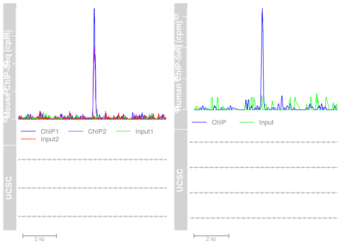
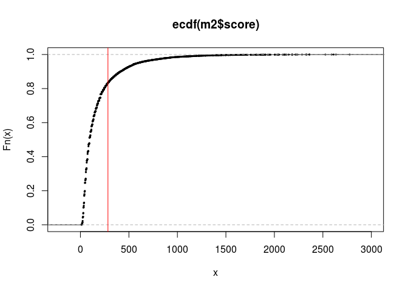
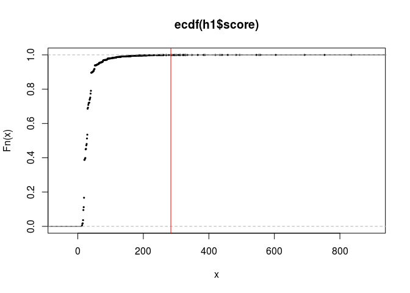
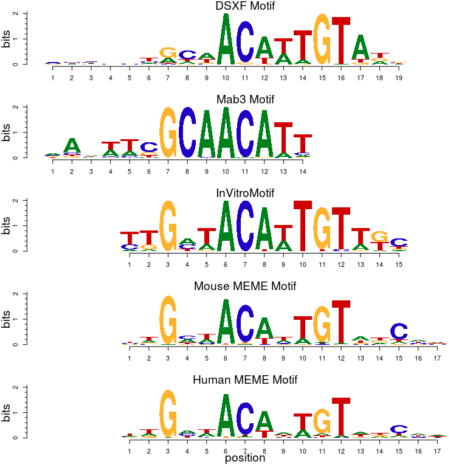
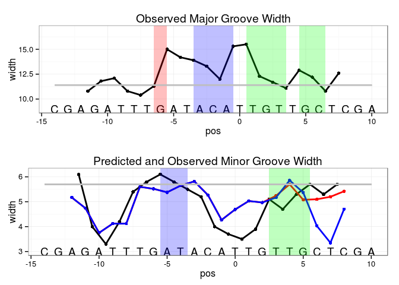
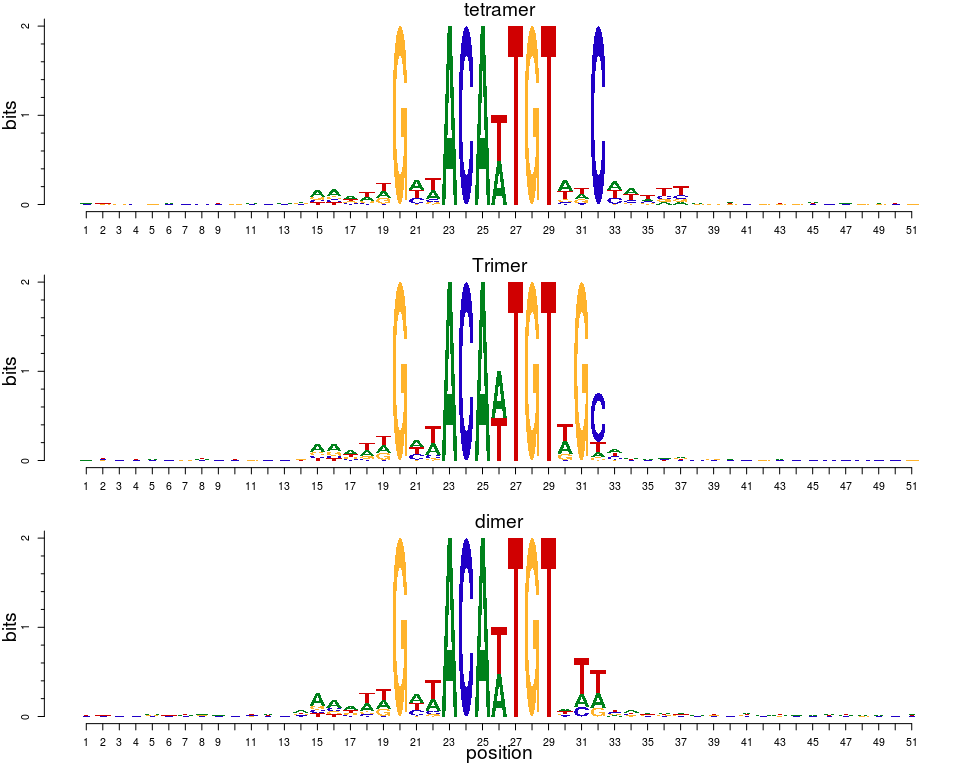
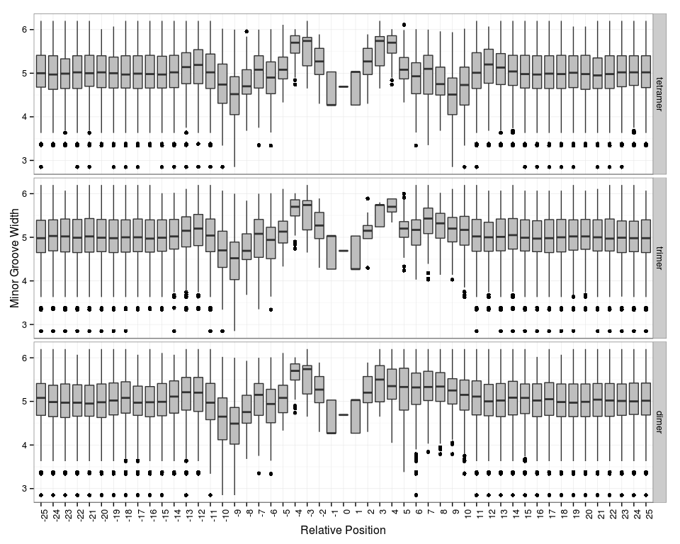
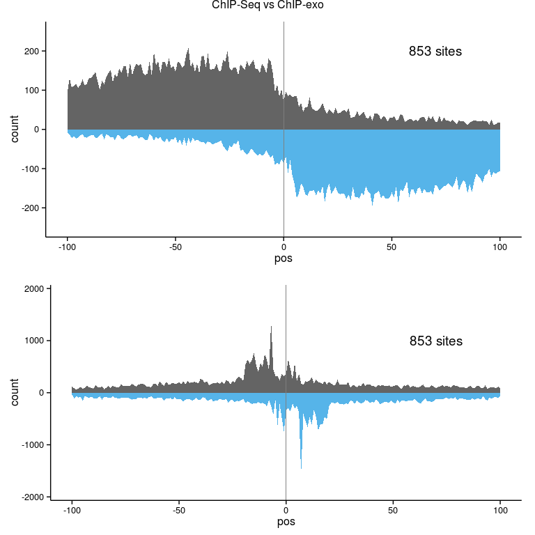
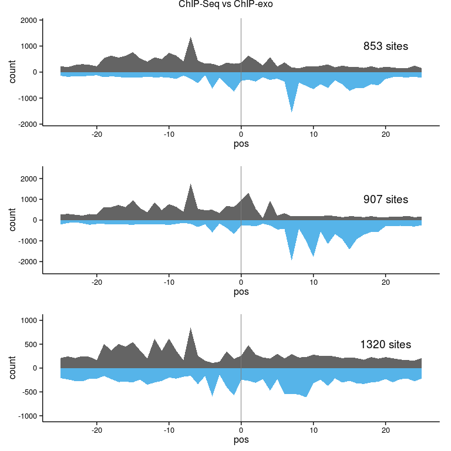

# An ancient protein-DNA interaction underlying metazoan sex determination
Micah D Gearhart  
`r format(Sys.time(), '%d %B %Y')`  

  This document contains an annotated workflow of the informatics analyses
  including software settings and options, diagnostic plots of data quality and methods
  for statistical tests that can be reproduced in the R programming language.  The
  source code is available at https://github.com/micahgearhart/exotools.
  
# Install Software from bioconductor.org.
For more information, please see http://bioconductor.org/install/. This only needs to be done once.

```r
source("http://bioconductor.org/biocLite.R")
biocLite("ggplot2")
biocLite("gridExtra")
biocLite("rtracklayer")
biocLite("GenomicFeatures")
biocLite("Gviz")
biocLite("TxDb.Mmusculus.UCSC.mm9.knownGene")
biocLite("TxDb.Hsapiens.UCSC.hg19.knownGene")
biocLite("Rsamtools")
biocLite("BSgenome.Mmusculus.UCSC.mm9")
biocLite("BSgenome.Mmusculus.UCSC.mm10")
biocLite("BSgenome.Hsapiens.UCSC.hg19")
biocLite("dplyr")
biocLite("tidyr")
biocLite("magrittr")
biocLite("downloader")
biocLite("BiocParallel")
biocLite("motifStack")
biocLite("GenomicFiles")
biocLite("R.utils")
biocLite("org.Mm.eg.db")

#load functions for ChIP-exo Analysis
biocLite("devtools")
library("devtools")
install_github("micahgearhart/exotools")
```


# Load Software from bioconductor.org

The following section loads software that has been previously downloaded from the Bioconductor repository.  This must be done for every R session.


```r
#Graphics
library(ggplot2)
library(gridExtra)
library(rtracklayer)
library(GenomicFeatures)
library(Gviz)
library(TxDb.Mmusculus.UCSC.mm9.knownGene)
library(TxDb.Hsapiens.UCSC.hg19.knownGene)
library(Rsamtools)

suppressMessages(library(BSgenome.Mmusculus.UCSC.mm9))
mm9<-BSgenome.Mmusculus.UCSC.mm9
suppressMessages(library(BSgenome.Mmusculus.UCSC.mm10))
mm10<-BSgenome.Mmusculus.UCSC.mm10
suppressMessages(library(BSgenome.Hsapiens.UCSC.hg19))
hg19<-BSgenome.Hsapiens.UCSC.hg19

library(dplyr)
library(tidyr)
library(magrittr)
library(downloader)
library(BiocParallel)
register(MulticoreParam(workers=detectCores()))
library(motifStack)
library(GenomicFiles)
library(R.utils)
library(org.Mm.eg.db)
library(exotools)
#source("R/exotools.R")

#Load Chain files Downlowded from http://hgdownload.cse.ucsc.edu/goldenpath/
h2m_chain<-import.chain("/usr/ngs/db/hg19ToMm9.over.chain")
m2h_chain<-import.chain("/usr/ngs/db/mm9ToHg19.over.chain")
mm10Tomm9<-import.chain("/usr/ngs/db/mm10ToMm9.over.chain")
mm9Tomm10<-import.chain("/usr/ngs/db/mm9ToMm10.over.chain")
```

# Map reads at the Minnesota Supercomputing Institute
Reads were processed using Trimmomatic, bwa and samtools using computing resources at the Minnesota Supercomputing

```r
dd=/home/bardwell/gearhart/dmrt1/chip/fastq
wd=/home/bardwell/gearhart/dmrt1/chip
org=mm9
#org=hg19

for i in 111007_L4_R1_Mouse_8w_chip2 111223_L3_R1_Mouse_8w_rep_2_chip6 120126_L8_R1_Mouse_8w_rep_2_chip6 111007_L5_R1_Mouse_8w_chip2 111223_L4_R1_Mouse_8w_rep_2_input6

#for i in 110909_L2_R1_human_input1 110909_L1_R1_human_chip1

do

cat << EOF > $i.bwa.pbs
#PBS -l mem=24gb,nodes=1:ppn=1,walltime=24:00:00 
#PBS -m a
#PBS -M gearh006@umn.edu 
#PBS -q lab 

cd $wd

#module load trimmomatic

java -Xmx20g -jar /panfs/roc/itascasoft/trimmomatic/0.32/trimmomatic.jar SE \
-threads 8 -phred33 -trimlog $i.trimlog fastq/$i.fastq fastq/$i.trimmed.fastq.gz \
ILLUMINACLIP:/panfs/roc/itascasoft/trimmomatic/0.32/adapters/TruSeq3-SE.fa:2:30:10 LEADING:3 TRAILING:3 SLIDINGWINDOW:4:5 MINLEN:25 

module load bwa

#bwa mem -t 8 -M /panfs/roc/rissdb/genomes/Homo_sapiens/$org/bwa/$org.fa fastq/$i.trimmed.fastq.gz > $i.sam
bwa mem -t 8 -M /panfs/roc/rissdb/genomes/Mus_musculus/$org/bwa/$org.fa fastq/$i.trimmed.fastq.gz > $i.sam

module load samtools

#convert sam to bam
samtools view -bS -o $i.raw.bam  $i.sam

#sort the bam file
samtools sort $i.raw.bam $i

#remove duplicates
#java -Xmx16g -jar /home/bardwell/shared/picard-tools-1.98/MarkDuplicates.jar INPUT=$i.sort.bam OUTPUT=$i.bam REMOVE_DUPLICATES=true ASSUME_SORTED=true METRICS_FILE=$i.metrics MAX_FILE_HANDLES_FOR_READ_ENDS_MAP=1000 VALIDATION_STRINGENCY=LENIENT 

#create the index file
samtools index $i.bam

#igvtools to make a TDF File
java -Xmx20g  -jar /home/bardwell/shared/IGVTools_2/igvtools.jar count -z 5 -w 25 -e 100 $i.bam $i.tdf /home/bardwell/shared/IGVTools_2/genomes/$org.genome

module load bedtools
#./fetchChromSizes hg19 > hg19.chromsize
#./fetchChromSizes mm9 > mm9.chromsize

bedtools genomecov -bg -ibam $i.bam > $i.bedGraph
./bedGraphToBigWig $i.bedGraph hg19.chromsize $i.bw

#s3cmd put input_human_hg19.bw s3://dmrt1
#s3cmd setacl -P -r s3://dmrt1/input_human_hg19.bw

EOF

qsub $i.bwa.pbs

done
```

#Chip-exo Processing

```r
wd=/home/bardwell/gearhart/dmrt1/exo
index=/panfs/roc/rissdb/genomes/Mus_musculus/mm9/bwa/mm9.fa
org=mm9

cat << EOF > exo.bwa.pbs
#PBS -l mem=20g,nodes=1:ppn=1,walltime=4:00:00 
#PBS -m a
#PBS -M gearh006@umn.edu 
#PBS -q lab 

cd $wd
#module load trimmomatic

java -Xmx16g -jar $TRIMMOMATIC/trimmomatic.jar PE \
-threads 8 -phred33 -trimlog log \
L1_R1_ATCACG_idx1_Bardwell_007_Mouse_Exo.fastq  L1_R2_ATCACG_idx1_Bardwell_007_Mouse_Exo.fastq \
L1.R1_trimmed.fastq.gz L1.UR1_trimmed.fastq.gz \
L1.R2_trimmed.fastq.gz L1.UR2_trimmed.fastq.gz \
ILLUMINACLIP:$TRIMMOMATIC/adapters/TruSeq3-PE.fa:2:30:10 LEADING:3 TRAILING:3 SLIDINGWINDOW:4:5 MINLEN:25 

java -Xmx16g -jar $TRIMMOMATIC/trimmomatic.jar PE \
-threads 8 -phred33 -trimlog log \
L8_R1_ATCACG_idx1_Mouse_exo.fastq L8_R2_ATCACG_idx1_Mouse_exo.fastq \
L8.R1_trimmed.fastq.gz L8.UR1_trimmed.fastq.gz \
L8.R2_trimmed.fastq.gz L8.UR2_trimmed.fastq.gz \
ILLUMINACLIP:$TRIMMOMATIC/adapters/TruSeq3-PE.fa:2:30:10 LEADING:3 TRAILING:3 SLIDINGWINDOW:4:5 MINLEN:25 

zcat L1.R1_trimmed.fastq.gz L8.R1_trimmed.fastq.gz > R1.fastq
zcat L1.R2_trimmed.fastq.gz L8.R2_trimmed.fastq.gz > R2.fastq

# Run a fastqc
/home/bardwell/shared/FastQC/fastqc -o fastqc R1.fastq
/home/bardwell/shared/FastQC/fastqc -o fastqc R2.fastq

module load bwa

bwa mem -t 8 -M $index R1.fastq R2.fastq > exo_bwa2.sam

module load samtools

#convert sam to bam
samtools view -bS -o exo_bwa2.raw.bam  exo_bwa2.sam

#pull out mapped r2's
samtools view -b -f147 -o exo_bwa2_f147.raw.bam exo_bwa2.raw.bam 
samtools view -b -f163 -o exo_bwa2_f163.raw.bam exo_bwa2.raw.bam 

#sort the bam file
samtools sort exo_bwa2.raw.bam exo_bwa2
samtools sort exo_bwa2_f147.raw.bam exo_bwa2_f147
samtools sort exo_bwa2_f163.raw.bam exo_bwa2_f163

#create a r2 only bam file
samtools merge exo_bwa2_r2.bam exo_bwa2_f163.bam exo_bwa2_f147.bam

#remove duplicates
#java -Xmx16g -jar /home/bardwell/shared/picard-tools-1.98/MarkDuplicates.jar INPUT=$i.sort.bam OUTPUT=$i.bam REMOVE_DUPLICATES=true ASSUME_SORTED=true METRICS_FILE=$i.metrics MAX_FILE_HANDLES_FOR_READ_ENDS_MAP=1000 VALIDATION_STRINGENCY=LENIENT 

#create the index file
samtools index exo_bwa2.bam
samtools index exo_bwa2_r2.bam
samtools index exo_bwa2_f147.bam
samtools index exo_bwa2_f163.bam

#igvtools to make a TDF File
java -Xmx16g  -jar /home/bardwell/shared/IGVTools_2/igvtools.jar count -z 5 -w 25 -e 100 exo_bwa2.bam exo_bwa2.tdf /home/bardwell/shared/IGVTools_2/genomes/$org.genome

#Use genomecov to create bigWig files of 5' locations
module load bedtools
bedtools genomecov -strand - -5 -ibam exo_bwa2_r2.bam -g mm9.chromsize -bg > exo_bwa2_r2_5-.bedGraph
./bedGraphToBigWig  exo_bwa2_r2_5-.bedGraph mm9.chromsize exo_bwa2_r2_5-.bigWig
bedtools genomecov -strand + -5 -ibam exo_bwa2_r2.bam -g mm9.chromsize -bg > exo_bwa2_r2_5+.bedGraph
./bedGraphToBigWig  exo_bwa2_r2_5+.bedGraph mm9.chromsize exo_bwa2_r2_5+.bigWig

EOF

qsub exo.bwa.pbs
```


# ChIP-Seq Profiles at LRH1 for Human and Mouse
Figure 1A shows a plot of DMRT1 ChIP-Seq signal from mouse and human at the LRH1 locus.  BigWig files of these tracks are available [here](http://www.ncbi.nlm.nih.gov/geo/download/?acc=GSE64892&format=file) and can easily be viewed in visualization tools like IGV.  The code below used the R package GViz to create Figure 1A.

## Define local BAM File locations
This section creates two variables, mouse and human, that define the bam file locations.  To recreate this plot, change the locations of files to match the locations of Bam files on your local computer.  The total number of reads in each bam file is also counted to normalized the counts to the sequencing depth.

```r
setClass("fileset", representation( filename="character",count="numeric",tx="TxDb"))

#Define Mouse Chip Datasets
mouse<-new("fileset", filename=c("/mnt/afp/micah/R/umn-gcd-bioinformatics-exo/bam/111007_L5_R1_Mouse_8w_input2.bam",
                                 "/mnt/afp/micah/R/umn-gcd-bioinformatics-exo/bam/111007_L4_R1_Mouse_8w_chip2.bam",
                                 "/mnt/afp/micah/R/umn-gcd-bioinformatics-exo/bam/111223_L4_R1_Mouse_8w_rep_2_input6.bam",
                                 "/mnt/afp/micah/R/umn-gcd-bioinformatics-exo/bam/chip6.bam",
                                 "/mnt/afp/murphy/data/mm9/exo_bwa2_r2.bam"))

for (i in 1:length(mouse@filename)) {
  mouse@count[i]<-countBam(mouse@filename[i],param=ScanBamParam(flag = scanBamFlag(isUnmappedQuery = FALSE,
                            isFirstMateRead = FALSE,  isMinusStrand = TRUE)))$records }  
mouse@tx<-TxDb.Mmusculus.UCSC.mm9.knownGene

#Define Human Chip Datasets
human<-new("fileset",filename=c("/mnt/afp/micah/R/umn-gcd-bioinformatics-exo/bam/110909_L2_R1_human_input1.bam",
                                "/mnt/afp/micah/R/umn-gcd-bioinformatics-exo/bam/110909_L1_R1_human_chip1.bam"))

for (i in 1:length(human@filename)) {
  human@count[i]<-countBam(human@filename[i],param=ScanBamParam(flag = scanBamFlag(isUnmappedQuery = FALSE,
                            isFirstMateRead = FALSE,  isMinusStrand = TRUE)))$records }  
human@tx<-TxDb.Hsapiens.UCSC.hg19.knownGene

#data is stored in a local file
save(mouse,human,file="filesets.Rdata")
```

## Fig 1a. - GViz Plotting function for Mouse and Human
This section creates a plot based on genomic coordinates in the mouse genome.  An mm9 to hg19 liftover is used to find the corresponding region in the human genome and make side-by-side plots.

```r
setClass("fileset", representation( filename="character",count="numeric",tx="TxDb"))
load("filesets.Rdata")
#SQlite connections expire
mouse@tx<-TxDb.Mmusculus.UCSC.mm9.knownGene
human@tx<-TxDb.Hsapiens.UCSC.hg19.knownGene
AxisTrack <- GenomeAxisTrack()

#meiob
#plotGviz("chr17:24,955,916-24,964,108")

#sdc3
#plotGviz("chr4:130,356,152-130,360,903")

#lrh
plotGviz("chr1:138,807,639-138,816,433")
```

```
## GRanges object with 1 range and 0 metadata columns:
##       seqnames                 ranges strand
##          <Rle>              <IRanges>  <Rle>
##   [1]     chr1 [138807639, 138816433]      *
##   -------
##   seqinfo: 1 sequence from an unspecified genome; no seqlengths
## GRanges object with 1 range and 0 metadata columns:
##       seqnames                 ranges strand
##          <Rle>              <IRanges>  <Rle>
##   [1]     chr1 [200041338, 200049783]      *
##   -------
##   seqinfo: 1 sequence from an unspecified genome; no seqlengths
```

 

```r
#Larger view of lrh that was shown in the paper
#plotGviz("chr1:138,718,851-138,879,389")
```

# Determine which DMRT1 binding sites are conserved between human and mouse

## Call Peaks with MACS
MACS version 2.1.0.20140616 was used to call peaks on ChIP-Seq data

```r
#The second replicate for mouse was underloaded on the first sequencing run so reads were combined.
samtools merge chip6.bam 111007_L4_R1_Mouse_8w_chip2.bam 111223_L3_R1_Mouse_8w_rep_2_chip6.bam
samtools index chip6.bam

#mouse
macs callpeak -t chip6.bam -c 111223_L4_R1_Mouse_8w_rep_2_input6.bam -f BAM -g mm -n mouse6 -p 0.05
macs callpeak -t 111007_L4_R1_Mouse_8w_chip2.bam -c 111007_L5_R1_Mouse_8w_input2.bam -f BAM -g mm -n mouse2 -p 0.05

#human
macs callpeak -t 110909_L1_R1_human_chip1.bam -c 110909_L2_R1_human_input1.bam -f BAM -g hs -n human1 -p 0.05
```

##Load Mouse Peaks

```r
m6peaks<-read.table("inst/extdata/mouse6_peaks.narrowPeak",stringsAsFactors = FALSE)
m6<-GRanges(seqnames=m6peaks$V1,ranges = IRanges(start=m6peaks$V2,end=m6peaks$V3),
            strand="*",score=m6peaks$V5,e=m6peaks$V7,summit=m6peaks$V10)
m2peaks<-read.table("inst/extdata/mouse2_peaks.narrowPeak",stringsAsFactors = FALSE)
m2<-GRanges(seqnames=m2peaks$V1,ranges = IRanges(start=m2peaks$V2,end=m2peaks$V3),
            strand="*",score=m2peaks$V5,e=m2peaks$V7,summit=m2peaks$V10)
temp<-findOverlaps(m2,m6,ignore.strand=TRUE)
m<-m2[queryHits(temp)]
m$score2<-m6[subjectHits(temp)]$score
m$e2<-m6[subjectHits(temp)]$e

#Filter out blacklisted regions
#download("http://www.broadinstitute.org/~anshul/projects/mouse/blacklist/mm9-blacklist.bed.gz",
#         destfile="mm9-blacklist.bed.gz")
#gunzip("mm9-blacklist.bed.gz")
mBL <-import("mm9-blacklist.bed")
m2<-m[!m%over%mBL]

temp<-ecdf(m2$score)
plot(ecdf(m2$score),pch=19,cex=0.3)
abline(v=quantile(m2$score,5/6,type=1),col="red")
```

 

```r
m2top<-m2[m2$score > quantile(m2$score,5/6,type=1)]
```

## Load Human Peaks

```r
#download("http://hgdownload.cse.ucsc.edu/goldenPath/hg19/encodeDCC/wgEncodeMapability/wgEncodeDacMapabilityConsensusExcludable.bed.gz", destfile="hg19-blacklist.bed.gz")
#gunzip("hg19-blacklist.bed.gz")
hBL<-import("hg19-blacklist.bed")

h1peaks<-read.table("inst/extdata/human1_peaks.narrowPeak",stringsAsFactors = FALSE)
h1<-GRanges(seqnames=h1peaks$V1,ranges = IRanges(start=h1peaks$V2,end=h1peaks$V3),
            strand="*",score=h1peaks$V5,e=h1peaks$V7,summit=h1peaks$V10)
length(h1)
```

```
## [1] 73343
```

```r
h1<-h1[!h1%over%hBL]
temp<-ecdf(h1$score)
plot(ecdf(h1$score),pch=19,cex=0.3)
abline(v=quantile(m2$score,5/6,type=1),col="red")
```

 

```r
h1top<-h1[h1$score > quantile(h1$score,5/6,type=1)]
```

## Conservation of DMRT1 binding sites
We would like to know it the major peaks we see in human are conserved in mouse and vice-versa.   Make a venn diagram to use as supplemental figure.

```r
#Move all mouse peaks over to human coordinates
m2_on_h19<-liftOver(m2,m2h_chain)
m2_on_h19u<-unlist(m2_on_h19)
length(h1top) #7593
length(h1top[h1top %over% m2_on_h19u]) #367
h_con<-h1top[h1top %over% m2_on_h19u]

h1top_on_m9<-liftOver(h1top,h2m_chain)
length(h1top)
temp<-unlist(lapply(h1top_on_m9,length))
sum(temp!=0) #4188

sum(h1top[temp!=0] %over% m2_on_h19u) #367

#move all human peaks over to mouse coordinates
h1_on_mm9 <- liftOver(h1,h2m_chain)
h1_on_mm9u<-unlist(h1_on_mm9)
length(m2top) #8571
length(m2top[m2top %over% h1_on_mm9u]) #341
m_con<-m2top[m2top %over% h1_on_mm9u]

m2top_on_h19<-liftOver(m2top,m2h_chain)
temp<-unlist(lapply(m2top_on_h19,length))
sum(temp!=0) #6024
```

## Summary
4188 of the 7593 peaks in the top sextile of the human chip have known syntenic regions in the mm9 build of the mouse genome.   Of these 4188, only 367 overlap mouse peaks (~ 9%).

6024 of the 8571 peaks in the top sextile of the mouse chip have syntenic regions in the hg19 build of the human genome.  Of these 6024, only 341 overlap human peaks (~ 6%).

#Fig. 1b - Extract DNA under the summits of mouse and human peaks and use Meme to find enriched motifs

Mouse Summits

```r
m2summit<-GRanges(seqnames(m2top),IRanges(start=start(m2top)+m2top$summit-50,width=100))
m2summit<-extractDNAfromGR(m2summit,mm9)
temp<-m2summit$dna
names(temp)<-paste0(seqnames(m2summit),":",start(m2summit),"-",end(m2summit))
writeXStringSet(temp,file="mouse_summits.fa")
#system("/usr/ngs/bin/meme_4.9/bin/meme mouse_summits.fa -oc mouse_meme -maxsize 100000000 -text -dna -revcomp -w 13")
```

## Use parallel meme to find Enriched Mouse Motifs
Use version 4.10.0 of meme_p to search the sequence around all the summits using computing resources at MSI.

```r
#PBS -l mem=16g,nodes=1:ppn=16,walltime=12:00:00 
#PBS -m a
#PBS -M gearh006@umn.edu 
#PBS -q sb 

cd /home/bardwell/gearhart/dmrt1/chip/meme/
PATH=/home/bardwell/shared/meme_p/bin:$PATH

module load intel
export OMP_NUM_THREADS=16

meme mouse_summits.fa -oc mouse_meme -maxsize 100000000 -text -dna -revcomp -w 13 -p 16 -nostatus > mouseSextile.out

cat mouseSextile.out |  grep chr |\
 awk '{ if (($2=="+") or ($2=="-")) print $0}'  |\
 awk '{ if ($4~"e") print $0 }' |\
 awk '{if (NF == 6) {printf("%s .\n",$0)} else {print $0}}' >mouseSextile_sites.out
```


## Parse MEME Output Mouse

```r
temp<-read.table("../meme/itasca_mouseSextile_sites.out",stringsAsFactors=FALSE)
temp$seq<-sapply(strsplit(temp$V1,":"),function(x) x[1])
temp$pos<-sapply(strsplit(temp$V1,":"),function(x) x[2])
temp$pos<-as.integer(sapply(strsplit(temp$pos,"-"),function(x) x[1]))+temp$V3
#temp[temp$V2=="+",]$pos<-temp[temp$V2=="+",]$pos-1
#temp[temp$V2=="-",]$pos<-temp[temp$V2=="-",]$pos+1
mouse_meme<-GRanges(seqnames=temp$seq,IRanges(start=temp$pos-3,width=17),strand=temp$V2)
table(strand(mouse_meme))
mouse_meme<-extractDNAfromGR(mouse_meme,mm9)
head(mouse_meme$dna)
table(width(mouse_meme$dna))
idx<-subseq(mouse_meme$dna,3,3)!="G" & subseq(mouse_meme$dna,15,15)=="C"
table(idx)
mouse_meme[idx]$dna<-reverseComplement(mouse_meme[idx]$dna)
mean(subseq(mouse_meme$dna,3,3)=="G")
mean(subseq(mouse_meme$dna,15,15)=="C")
temp<-consensusMatrix(mouse_meme$dna)
mouseMotif<-new("pfm",mat=t(t(temp[1:4,])*1/colSums(temp[1:4,])), name="Mouse MEME Motif")
plotMotifLogo(mouseMotif)
#Export sequences to view motif with external programs (Weblogo)
#writeXStringSet(mouse_meme$dna,file="mouse_meme.fa")
```


## Human Summits

```r
h1summit<-GRanges(seqnames(h1top),IRanges(start=start(h1top)+h1top$summit-50,width=100))
m2summit<-extractDNAfromGR(h1summit,hg19)
temp<-h1summit$dna
names(temp)<-paste0(seqnames(h1summit),":",start(h1summit),"-",end(h1summit))
writeXStringSet(temp,file="human_summits.fa")
#system("/usr/ngs/bin/meme_4.9/bin/meme human_summits.fa -oc human_meme -maxsize 100000000 -text -dna -revcomp -w 13")
```

## Use parallel meme to find Enriched Human Motifs

```r
#PBS -l mem=16g,nodes=1:ppn=16,walltime=12:00:00 
#PBS -m a
#PBS -M gearh006@umn.edu 
#PBS -q sb 

cd /home/bardwell/gearhart/dmrt1/chip/meme/
PATH=/home/bardwell/shared/meme_p/bin:$PATH

module load intel
export OMP_NUM_THREADS=16

meme human_summits.fa -oc human_meme -maxsize 100000000 \
-text -dna -revcomp -w 13 -p 16 -nostatus > humanSextile.out

cat humanSextile.out |  grep chr |\
 awk '{ if (($2=="+") or ($2=="-")) print $0}'  |\
 awk '{ if ($4~"e") print $0 }' |\
 awk '{if (NF == 6) {printf("%s .\n",$0)} else {print $0}}' >humanSextile_sites.out
```


## Parse MEME output Human

```r
#human
temp<-read.table("../meme/itasca_humanSextile_sites.out",stringsAsFactors=FALSE)
temp$seq<-sapply(strsplit(temp$V1,":"),function(x) x[1])
temp$pos<-sapply(strsplit(temp$V1,":"),function(x) x[2])
temp$pos<-as.integer(sapply(strsplit(temp$pos,"-"),function(x) x[1]))+temp$V3
#temp[temp$V2=="+",]$pos<-temp[temp$V2=="+",]$pos-1
#temp[temp$V2=="-",]$pos<-temp[temp$V2=="-",]$pos+1
human_meme<-GRanges(seqnames=temp$seq,IRanges(start=temp$pos-3,width=17),strand=temp$V2)
table(strand(human_meme))
human_meme<-extractDNAfromGR(human_meme,hg19)
head(human_meme$dna)
table(width(human_meme$dna))
idx<-subseq(human_meme$dna,3,3)!="G" & subseq(human_meme$dna,15,15)=="C"
table(idx)
human_meme[idx]$dna<-reverseComplement(human_meme[idx]$dna)
mean(subseq(human_meme$dna,3,3)=="G")
mean(subseq(human_meme$dna,15,15)=="C")
temp<-consensusMatrix(human_meme$dna)
humanMotif<-new("pfm",mat=t(t(temp[1:4,])*1/colSums(temp[1:4,])), name="Human MEME Motif")
plotMotifLogo(humanMotif)
#Export sequences to view motif with external programs (Weblogo)
#writeXStringSet(human_meme$dna,file="human_meme.fa")
```

## Make Weblogos Fig. 1b and Fig. 6a
Consensus matrices were created from published site selection data.

```r
fa<-readDNAStringSet("inst/extdata/murphy_2007_site_selection.fa")
temp<-consensusMatrix(fa)
InVitroMotif<-new("pfm",mat=t(t(temp[1:4,])*1/colSums(temp[1:4,])), name="InVitroMotif")
plotMotifLogo(InVitroMotif)

mab3<-readDNAStringSet("inst/extdata/mab3.fa")
temp<-consensusMatrix(mab3)
mab3Motif<-new("pfm",mat=t(t(temp[1:4,])*1/colSums(temp[1:4,])), name="Mab3 Motif")
plotMotifLogo(mab3Motif)

dsxf<-readDNAStringSet("inst/extdata/dsxf.fa")
temp<-consensusMatrix(dsxf)
dsxfMotif<-new("pfm",mat=t(t(temp[1:4,])*1/colSums(temp[1:4,])), name="DSXF Motif")
plotMotifLogo(dsxfMotif)

save(humanMotif,mouseMotif,InVitroMotif,mab3Motif,dsxfMotif,file="motifs.rdata")
```


```r
load("motifs.rdata")
plotMotifLogoStack(DNAmotifAlignment(list(humanMotif,mouseMotif,InVitroMotif,mab3Motif,dsxfMotif),revcomp=c(F,F,F,F,F)))
```

 

```r
#Weblogos used in paper
#plotMotifLogoStack(DNAmotifAlignment(list(humanMotif,mouseMotif,InVitroMotif),revcomp=c(F,F,F)))
#plotMotifLogoStack(DNAmotifAlignment(list(InVitroMotif,mab3Motif,dsxfMotif),revcomp=c(F,F,F)))
```


#Fig. 1d - Predicted and Observed Groove Width
The width of the Minor groove for the two sequences used in 1c was predicted using [DNAShape](http://rohslab.cmb.usc.edu/DNAshape/).  These predicted values are plotted with the observed major and minor groove width in the crystal structure. 

```r
(pdb1016<-read.table("inst/extdata/dna_101614_mgw.out",header=T,stringsAsFactor=F))
```

```
##    row  step minPP minRefined majPP majRefined
## 1    1 CG/CG   ---        ---   ---        ---
## 2    2 GA/TC   ---        ---   ---        ---
## 3    3 AG/CT  11.9        ---  16.6        ---
## 4    4 GA/TC   9.8        9.7  17.6       17.4
## 5    5 AT/AT   9.1        9.1  17.9       17.6
## 6    6 TT/AA  10.0       10.0  16.6       16.3
## 7    7 TT/AA  11.2       11.2  16.2       16.1
## 8    8 TG/CA  11.6       11.5  17.1       17.1
## 9    9 GA/TC  11.9       11.9  20.8       20.7
## 10  10 AT/AT  11.6       11.6  20.0       20.0
## 11  11 TA/TA  11.3       11.3  19.7       19.7
## 12  12 AC/GT  11.0       10.9  19.1       19.1
## 13  13 CA/TG   9.8        9.8  17.8       17.6
## 14  14 AT/AT   9.5        9.4  21.1       20.9
## 15  15 TT/AA   9.3        9.3  21.3       21.2
## 16  16 TG/CA   9.7        9.7  18.1       17.9
## 17  17 GT/AC  10.9       10.8  17.5       17.5
## 18  18 TT/AA  10.5       10.4  16.9       16.8
## 19  19 TG/CA  11.1       11.1  18.7       18.6
## 20  20 GC/GC  11.5       11.5  18.0       17.8
## 21  21 CT/AG  11.1       11.1  16.6       16.2
## 22  22 TC/GA  11.5        ---  18.4        ---
## 23  23 CG/CG   ---        ---   ---        ---
## 24  24 GA/TC   ---        ---   ---        ---
```

```r
(predicted<-t(read.csv("inst/extdata/mgw_prediction_structure_site.csv",header=F)))
```

```
##     [,1] [,2]
## V1  5.17 5.17
## V2  4.74 4.74
## V3  3.75 3.75
## V4  4.12 4.12
## V5  4.12 4.12
## V6  5.60 5.60
## V7  5.52 5.52
## V8  5.38 5.38
## V9  5.65 5.65
## V10 5.82 5.82
## V11 5.27 5.27
## V12 4.27 4.27
## V13 4.69 4.69
## V14 5.03 5.03
## V15 4.97 4.97
## V16 5.24 5.17
## V17 5.70 5.86
## V18 5.08 5.37
## V19 5.10 4.03
## V20 5.20 3.35
## V21 5.42 4.70
```

```r
predicted<-as.data.frame(predicted)
rownames(predicted)<-3:23
colnames(predicted)<-c("site1","site2")

dna3<-data.frame(mgw=as.numeric(pdb1016[3:22,"minPP"])-5.8,
                    maj=as.numeric(pdb1016[3:22,"majPP"])-5.8)
dna3$pos<-3:22-14.5
predicted$pos<-as.numeric(rownames(predicted))-15

temp <-rbind(dna3 %>% gather(variable,width,mgw,maj), predicted %>% gather(variable,width,site1,site2))
temp$variable<-as.character(temp$variable)

#Make Separate plots for major and minor groove
temp2<-dplyr::filter(temp,variable=="maj")
  temp<- dplyr::filter(temp,variable!="maj")
  
  p<-ggplot(temp, aes(x=pos,y=width,group=variable)) + 
  geom_point(color=ifelse(temp$variable=="mgw","black",ifelse(temp$variable=="site2","blue","red")))+
  geom_line(color=ifelse(temp$variable=="mgw","black",
            ifelse(temp$variable=="site2","blue","red")),
            size=1,aes(order=temp$variable)) + 
  theme_bw() + ylim(c(3,6.2))+ xlim(c(-14,10))

#Add the sequence to the plot
sequence = "CGAGATTTGATACATTGTTGCTCGA"
for (i in 1:nchar(sequence)){
  p<- p + annotate("text",label=substr(sequence,i,i),x=i-15,y=3)
}
#Add colored rectangles to show where the protomers sit
p<-p+annotate("rect",xmin=2.5, xmax=5.5, ymin=-Inf, ymax=Inf, fill="green",alpha=0.25)
p<-p+annotate("rect",xmin=-5.5, xmax=-3.5, ymin=-Inf, ymax=Inf, fill="blue",alpha=0.25)
p<-p+geom_segment(aes(x = -14, y = 5.7, xend = 10, yend = 5.7),color="gray")
p<-p+ggtitle("Predicted and Observed Minor Groove Width")


############# MAJOR GROOVE #########
  q<-ggplot(temp2, aes(x=pos,y=width,group=variable)) + 
  geom_point(color="black")+
  geom_line(color="black",size=1) + 
  theme_bw() + ylim(c(9,17))+ xlim(c(-14,10))

#Add the sequence to the plot
sequence = "CGAGATTTGATACATTGTTGCTCGA"
for (i in 1:nchar(sequence)){
  q<- q + annotate("text",label=substr(sequence,i,i),x=i-15,y=9)
}

#Add colored rectangles to show where the protomers sit
q<-q+annotate("rect",xmin=-6.5, xmax=-5.5, ymin=-Inf, ymax=Inf, fill="red",alpha=0.25)
q<-q+annotate("rect",xmin=-3.5, xmax=-0.5, ymin=-Inf, ymax=Inf, fill="blue",alpha=0.25)
q<-q+annotate("rect",xmin=0.5, xmax=3.5, ymin=-Inf, ymax=Inf, fill="green",alpha=0.25)
q<-q+annotate("rect",xmin=4.5, xmax=6.5, ymin=-Inf, ymax=Inf, fill="green",alpha=0.25)
q<-q+geom_segment(aes(x = -14, y = 11.4, xend = 10, yend = 11.4),color="gray")
q<-q+ggtitle("Observed Major Groove Width")

#pdf(file="120614_grooves.pdf",width=8.5,height=6,colormodel="cmyk")
grid.arrange(q,p,ncol=1)
```

 

```r
#dev.off()
```

# Identify Genomic Loci that conform to the sequence and shape

## Find all the potential DMRT1 binding sites in the mm10 genome.
Since the genome-wide GBShape data is available for mm10, we will use this sequence to find all the potential DMRT1 binding sites.

```r
pattern<-"ACAWTGT"
WIDTH<-51 #must be odd
FLANK<-(WIDTH-nchar(pattern))/2
NNNs<-paste0(rep("N",FLANK),collapse='')
expanded_pattern<-paste0(NNNs,pattern,NNNs,collapse='')
findsites(expanded_pattern,"chrY",build=mm10)
```

```
## GRanges object with 22015 ranges and 0 metadata columns:
##           seqnames               ranges strand
##              <Rle>            <IRanges>  <Rle>
##       [1]     chrY     [116154, 116204]      *
##       [2]     chrY     [127229, 127279]      *
##       [3]     chrY     [129703, 129753]      *
##       [4]     chrY     [137540, 137590]      *
##       [5]     chrY     [139128, 139178]      *
##       ...      ...                  ...    ...
##   [22011]     chrY [90706836, 90706886]      *
##   [22012]     chrY [90712257, 90712307]      *
##   [22013]     chrY [90717295, 90717345]      *
##   [22014]     chrY [90733178, 90733228]      *
##   [22015]     chrY [90809719, 90809769]      *
##   -------
##   seqinfo: 1 sequence from an unspecified genome; no seqlengths
```

##Find Sites Genome-wide

```r
chroms<- as.list(paste0("chr",c(1:19,"X","Y")))
names(chroms)<-chroms
#detectCores()
system.time(temp<-mclapply(chroms, function(x) findsites(expanded_pattern,x,build=mm10)))
sapply(temp,length)
head(temp)

temp2<-unlist(GRangesList(temp))
#temp2$orig_strand<-as.character(strand(temp2))
strand(temp2)<-"*"
temp2<-sort(temp2)
seqinfo(temp2)<-seqinfo(mm10)

#check for granges off the end of chromosomes
which(end(temp2) > seqlengths(mm10)[as.character(seqnames(temp2))])

summary(width(temp2))
#remove sites close to each other to avoid confounding 
d<-distanceToNearest(temp2)
d<-as.data.frame(d)
temp2<-temp2[d$distance > 2]
#sanity check's
length(temp2) == length(reduce(temp2))
summary(width(reduce(temp2)))
save(chroms,temp2,file="findsites_output.rdata")
```

## Subset these sites to get sites underneath DMRT1 peaks

```r
load("findsites_output.rdata")

#We are going to use all the 52359 dmrt1 peaks (m) because 
#some of the binding modes might be low intensity
m_clean<-keepSeqlevels(m,as.character(chroms))
m_mm10<-unlist(liftOver(m,mm9Tomm10))

temp2_dmrt1<-temp2[temp2 %over% m_mm10]

temp2_dmrt1<-extractDNAfromGR(temp2_dmrt1,mm10)
length(temp2_dmrt1)
```

```
## [1] 13531
```

```r
#make sure there are no N's in the widened sites
#(there is masked sequence adjacent to dmrt1 site 
# on chrom5 that was causing problems importing width data)
temp2_dmrt1<-temp2_dmrt1[vcountPattern("N",temp2_dmrt1$dna)== 0]
length(temp2_dmrt1)
```

```
## [1] 13530
```

## Read in Minor Groove Width from GBShape
On a high memory server convert the wig to bigWig.

```r
library("BSgenome.Mmusculus.UCSC.mm10")
library("rtracklayer")
si<-seqinfo(Mmusculus)
wigToBigWig("mm10.MGW.wig",si,dest="mm10.MGW.bigWig")
```

##Import Width Data for temp2_dmrt1 list

```r
#get minor group width data for all nucleotides in peak list
temp3 <- import("/mnt/afp/murphy/data/mm10/mm10.MGW.bigWig",which=temp2_dmrt1)

# check to make sure size of returned data is correct
sapply(chroms, function(x) WIDTH*length(keepSeqlevels(temp2_dmrt1,x))==length(keepSeqlevels(temp3,x)))

#write a function that will retrieve 51 minor groove width data for each temp2 peak
tabulateMGW<-function (x) {
blah<-findOverlaps(temp2_dmrt1[x],temp3)
temp3[subjectHits(blah)]$score
}
system.time(mgw_list2<-lapply(1:length(temp2_dmrt1),tabulateMGW))
save(mgw_list2,file="mgw_list2.rdata")
```

## Subset sites based on the left and right mean

```r
load("mgw_list2.rdata")
temp2_dmrt1$leftMean<-sapply(mgw_list2,function (x) mean(x[16:20]))
temp2_dmrt1$rightMean<-sapply(mgw_list2,function (x) mean(x[32:36]))

temp2_dmrt1$mm10wl<-paste0(seqnames(temp2_dmrt1),":",start(temp2_dmrt1),"-",end(temp2_dmrt1))

mgw_list2_mat<-matrix(unlist(mgw_list2),ncol=WIDTH,byrow=TRUE)
mgw_list2_mat[1:10,15:37]
```

```
##       [,1] [,2] [,3] [,4] [,5] [,6] [,7] [,8] [,9] [,10] [,11] [,12] [,13]
##  [1,] 4.51 3.74 3.35 4.70 5.82 6.00 5.33 4.85 4.85  4.30  4.27  4.69  5.03
##  [2,] 5.20 5.32 5.80 5.58 4.97 4.63 4.35 4.05 4.65  4.97  5.03  4.69  4.27
##  [3,] 5.08 5.62 5.20 5.13 5.48 5.56 5.29 5.04 4.99  5.57  5.03  4.69  4.27
##  [4,] 4.03 3.68 4.76 5.42 5.56 4.53 5.00 5.88 5.74  5.89  5.03  4.69  4.27
##  [5,] 5.90 4.89 4.78 5.10 5.05 4.65 5.10 5.91 5.99  5.27  4.27  4.69  5.03
##  [6,] 5.53 3.79 4.75 5.82 5.96 4.97 4.82 5.66 5.94  5.15  4.27  4.69  5.03
##  [7,] 4.65 5.05 5.10 4.98 5.48 5.93 5.40 4.74 4.65  4.30  4.27  4.69  5.03
##  [8,] 5.31 5.38 5.13 5.43 5.44 4.81 4.46 5.35 5.84  5.15  4.27  4.69  5.03
##  [9,] 3.34 3.85 4.74 5.40 6.00 5.65 5.24 5.05 5.50  5.20  5.03  4.69  4.27
## [10,] 5.47 4.98 3.75 4.81 5.46 6.00 5.40 4.74 4.65  4.97  5.03  4.69  4.27
##       [,14] [,15] [,16] [,17] [,18] [,19] [,20] [,21] [,22] [,23]
##  [1,]  4.97  4.65  4.74  4.74  4.80  4.92  5.45  5.08  5.36  5.37
##  [2,]  5.15  5.80  5.46  5.24  5.30  5.15  4.24  2.85  4.27  4.74
##  [3,]  5.27  5.74  5.88  5.00  4.53  5.43  5.32  5.13  5.20  5.76
##  [4,]  5.27  5.74  5.76  4.74  4.36  4.77  5.34  5.74  4.80  4.14
##  [5,]  4.97  4.65  4.74  4.74  5.14  5.33  4.95  5.17  5.85  5.58
##  [6,]  4.97  4.65  4.74  5.40  6.00  5.65  5.24  4.97  5.19  4.92
##  [7,]  5.20  5.80  5.46  4.93  4.93  5.46  5.56  4.84  5.08  5.42
##  [8,]  5.20  5.84  5.94  5.40  4.27  4.12  4.19  4.94  5.58  5.80
##  [9,]  4.30  5.24  5.70  5.30  4.82  4.51  4.63  4.50  4.80  4.02
## [10,]  5.02  4.99  5.04  5.29  5.90  5.60  4.76  3.38  3.38  3.63
```

```r
mgw_list2_df<-as.data.frame(mgw_list2_mat)
rownames(mgw_list2_df)<-temp2_dmrt1$mm10wl


boxplot(mgw_list2_df,pch=19,cex=0.3,range=0,main="Minor Groove Width of All potential Sites")
```

 


## LiftOver to mm9 to make exoplots

```r
length(temp2_dmrt1)
```

```
## [1] 13530
```

```r
colnames(mcols(temp2_dmrt1))[which(colnames(mcols(temp2_dmrt1))=="dna")]<-"mm10DNA"
temp2_dmrt1_mm9<-unlist(liftOver(temp2_dmrt1,mm10Tomm9))
length(temp2_dmrt1_mm9)
```

```
## [1] 13531
```

```r
head(temp2_dmrt1_mm9)
```

```
## GRanges object with 6 ranges and 4 metadata columns:
##     seqnames             ranges strand |
##        <Rle>          <IRanges>  <Rle> |
##   1     chr1 [3107734, 3107784]      * |
##   2     chr1 [4594664, 4594714]      * |
##   3     chr1 [4929001, 4929051]      * |
##   4     chr1 [5105108, 5105158]      * |
##   5     chr1 [5141014, 5141064]      * |
##   6     chr1 [5758242, 5758292]      * |
##                                                 mm10DNA  leftMean
##                                          <DNAStringSet> <numeric>
##   1 GTCACTGATCTTGGACTTTAGAACATTGTTTCTTGCTATTTTTATACACCT     4.722
##   2 AGCAGTGAAGCTACTGTGGAAAACAATGTGGCAATTTCTCAAAAGGTTGTG     5.260
##   3 CTTTGGATAACAGACTACTGAGACAATGTAGCCAGTAGAATTAGAATTTCT     5.398
##   4 CCAAAGCCATGAGCTTTTGGCTACAATGTAGATCAGCTTGGGGATGGTGGT     4.790
##   5 AACAGTGTCTTTTTGAGTGTTTACATTGTTTCTGTTAAGTGTTGGACTGAA     4.894
##   6 ACATTGAGCTCATTATTTAGGCACATTGTTTCAACAAGAGTTCTTAGTTTA     5.058
##     rightMean               mm10wl
##     <numeric>          <character>
##   1     5.122 chr1:3117653-3117703
##   2     4.362 chr1:4604583-4604633
##   3     5.122 chr1:4938920-4938970
##   4     5.002 chr1:5115027-5115077
##   5     5.288 chr1:5150933-5150983
##   6     5.410 chr1:5768161-5768211
##   -------
##   seqinfo: 21 sequences from an unspecified genome; no seqlengths
```

```r
temp2_dmrt1_mm9<-extractDNAfromGR(temp2_dmrt1_mm9,mm9)

#only keep peaks where the DNA hasn't changed mm9 to mm10
mean(temp2_dmrt1_mm9$dna==temp2_dmrt1_mm9$mm10DNA)
```

```
## [1] 0.9977829
```

```r
temp2_dmrt1_mm9<-temp2_dmrt1_mm9[temp2_dmrt1_mm9$dna==temp2_dmrt1_mm9$mm10DNA]
```

## Subsetting based on Shape

```r
#Bilateral Narrowing
sum(temp2_dmrt1_mm9$leftMean < 5 & temp2_dmrt1_mm9$rightMean < 5)
```

```
## [1] 2896
```

```r
# Unilateral Narrowing
sum(temp2_dmrt1_mm9$leftMean < 5 & temp2_dmrt1_mm9$rightMean > 5) + sum(temp2_dmrt1_mm9$leftMean > 5 & temp2_dmrt1_mm9$rightMean < 5)
```

```
## [1] 6778
```

## Create Tetramer Subset

```r
#Create logical variables for Sequence and Shape
seqFilter<-vcountPattern("G",subseq(temp2_dmrt1_mm9$dna,20,20),fixed="subject") & vcountPattern("C",subseq(temp2_dmrt1_mm9$dna,32,32),fixed="subject")

shapeFilter<-temp2_dmrt1_mm9$leftMean < 5 & temp2_dmrt1_mm9$rightMean < 5

#Create a GR object matching Seq and Shape criteria
tetramer_GR<-temp2_dmrt1_mm9[seqFilter & shapeFilter]
length(tetramer_GR)
```

```
## [1] 853
```

```r
#Create Consensus Motif
tempCM<-consensusMatrix(tetramer_GR$dna)
tetramerMotif<-new("pfm",mat=t(t(tempCM[1:4,])*1/colSums(tempCM[1:4,])), name="tetramer")

#Subset MGW dataframe for tetramerGR
tetramer_mat<-mgw_list2_df[tetramer_GR$mm10wl,]
colnames(tetramer_mat)<-paste0(as.character(-25:25))
tetramer_mat<- tetramer_mat %>% gather %>% mutate(mode="tetramer") 
```


## Create Trimer Subset
Trimers and dimers are a little more complicated becase we have to look on both strands.  Basically we create two sets of filters (one for top strand and one for bottom strand) then combine them keeping track of which strand the motif is on.

```r
#Trimers-Top Strand
seqFilter<-vcountPattern("G",subseq(temp2_dmrt1_mm9$dna,20,20),fixed="subject") & vcountPattern("G",subseq(temp2_dmrt1_mm9$dna,31,31),fixed="subject")

shapeFilter<-temp2_dmrt1_mm9$leftMean < 5 & temp2_dmrt1_mm9$rightMean > 5

temp_grF<-temp2_dmrt1_mm9[seqFilter & shapeFilter]
strand(temp_grF)<-"+"

#Subset MGW dataframe for temp_grF
mgwF<-mgw_list2_df[temp_grF$mm10wl,]

#Trimers-Bottom Strand
seqFilter<-vcountPattern("C",subseq(temp2_dmrt1_mm9$dna,32,32),fixed="subject") & vcountPattern("C",subseq(temp2_dmrt1_mm9$dna,21,21),fixed="subject")
shapeFilter<-temp2_dmrt1_mm9$leftMean > 5 & temp2_dmrt1_mm9$rightMean < 5

temp_grR<-temp2_dmrt1_mm9[seqFilter & shapeFilter]
strand(temp_grR)<-"-"

#Subset MGW dataframe for temp_grR
mgwR<-mgw_list2_df[temp_grR$mm10wl,]
mgwR2<-t(apply(mgwR,1,rev))
colnames(mgwR2)<-colnames(mgwF)


trimer_GR<-c(temp_grF,temp_grR)
table(strand(trimer_GR))
```

```
## 
##   +   -   * 
## 434 473   0
```

```r
length(trimer_GR)
```

```
## [1] 907
```

```r
#Create Consensus Motif
tempCM<-consensusMatrix(c(temp_grF$dna,reverseComplement(temp_grR$dna)))
trimerMotif<-new("pfm",mat=t(t(tempCM[1:4,])*1/colSums(tempCM[1:4,])), name="Trimer")


#Combine top and bottom strand Minor Groove Width Data 
trimer_mat <-rbind(mgwF,mgwR2) 
colnames(trimer_mat)<-paste0(as.character(-25:25))
trimer_mat<- trimer_mat %>% gather %>% mutate(mode="trimer")
```


## Create Dimer Subset

```r
#Dimers - Top Strand
seqFilter<-vcountPattern("G",subseq(temp2_dmrt1_mm9$dna,20,20),fixed="subject") & vcountPattern("H",subseq(temp2_dmrt1_mm9$dna,31,31),fixed="subject") &
  vcountPattern("D",subseq(temp2_dmrt1_mm9$dna,32,32),fixed="subject") 
shapeFilter<-temp2_dmrt1_mm9$leftMean < 5 & temp2_dmrt1_mm9$rightMean > 5
temp_grF<-temp2_dmrt1_mm9[seqFilter & shapeFilter]
strand(temp_grF)<-"+"

#Subset MGW dataframe for temp_grF
mgwF<-mgw_list2_df[temp_grF$mm10wl,]

#Dimers - Bottom Strand
seqFilter<-vcountPattern("C",subseq(temp2_dmrt1_mm9$dna,32,32),fixed="subject") & vcountPattern("D",subseq(temp2_dmrt1_mm9$dna,21,21),fixed="subject") &
  vcountPattern("H",subseq(temp2_dmrt1_mm9$dna,20,20),fixed="subject") 
shapeFilter<-temp2_dmrt1_mm9$leftMean > 5 & temp2_dmrt1_mm9$rightMean < 5
temp_grR<-temp2_dmrt1_mm9[seqFilter & shapeFilter]
strand(temp_grR)<-"-"

#Subset MGW dataframe for temp_grR
mgwR<-mgw_list2_df[temp_grR$mm10wl,]
mgwR2<-t(apply(mgwR,1,rev))
colnames(mgwR2)<-colnames(mgwF)

dimer_GR<-c(temp_grF,temp_grR)
table(strand(dimer_GR))
```

```
## 
##   +   -   * 
## 659 661   0
```

```r
length(dimer_GR)
```

```
## [1] 1320
```

```r
#Create Consensus Motif
tempCM<-consensusMatrix(c(temp_grF$dna,reverseComplement(temp_grR$dna)))
 dimerMotif<-new("pfm",mat=t(t(tempCM[1:4,])*1/colSums(tempCM[1:4,])), name="dimer")

#Combine top and bottom strand Minor Groove Width Data 
dimer_mat <-rbind(mgwF,mgwR2) 
colnames(dimer_mat)<-paste0(as.character(-25:25))
dimer_mat<- dimer_mat %>% gather %>% mutate(mode="dimer")
```

## Sup. Fig. 4C - Plot Consensus motifs around Tetramer, Trimer and Dimer Motifs

```r
plotMotifLogoStack(list(dimerMotif,trimerMotif,tetramerMotif))
```

 

## Sup. Fig. 4D - Plot Minor Groove Width around Tetramer, Trimer and Dimer Motifs

```r
boxMat<-rbind(tetramer_mat,trimer_mat,dimer_mat)
boxMat$mode<-factor(boxMat$mode,levels=c("tetramer","trimer","dimer"))

boxMat %>% ggplot(aes(x=key,y=value))+geom_boxplot(fill="gray")+theme_bw()+xlab("Relative Position")+ylab("Minor Groove Width")+theme(axis.text.x = element_text(angle = 90, hjust = 1))+facet_grid(mode ~ .)
```

 


# Aggregate ChIP-Seq and ChIP-exo data across dimer, trimer and tetramer locations
In a ChIP-exo dataset, the 5' position of the read tells you where the exonuclease stopped.  In our experiment we used paired end sequencing to help with the mapping.  We used Rsamtools to extract the 5' end of the R2 mate and aggregated the alignments across Dmrt1 binding sites across the genome.

#Use the pileupGR function to aggregate 5'ends

```r
exo_file<-"/mnt/afp/murphy/data/mm9/exo_bwa2_r2.bam"
chip_file<-"/mnt/afp/micah/R/umn-gcd-bioinformatics-exo/bam/111007_L4_R1_Mouse_8w_chip2.bam"
 
#Define colors for top and bottom strand figures.
col2=rgb(100,100,100,max=255)
col1=rgb(86,180,233,max=255)

#Define pileup parameters to get position of first nucleotide for reads on each strand.
p_param <- Rsamtools::PileupParam(cycle_bins=c(0,1),
                       distinguish_nucleotides=FALSE,
                       distinguish_strands=TRUE,
                       min_nucleotide_depth=1)

# Set ncycle to number of cycles in exo experiment.
ncycle=50

g4_51<-pileupGR(tetramer_GR, exo_file) + 
  theme(legend.position="none") + #ggtitle("tetramer-Exo51")+
  scale_fill_manual(values=c(col1,col2)) + geom_segment(x=0,y=-Inf,xend=0,yend=Inf,size=0.0625,color="gray50")
g3_51<-pileupGR(trimer_GR, exo_file) + 
  theme(legend.position="none") + #ggtitle("trimer-Exo51")+
  scale_fill_manual(values=c(col1,col2)) + geom_segment(x=0,y=-Inf,xend=0,yend=Inf,size=0.0625,color="gray50")
g2_51<-pileupGR(dimer_GR, exo_file) + 
  theme(legend.position="none") + #ggtitle("dimer-Exo51")+
  scale_fill_manual(values=c(col1,col2)) + geom_segment(x=0,y=-Inf,xend=0,yend=Inf,size=0.0625,color="gray50")
#grid.arrange(g2_51,g3_51,g4_51,ncol=1,as.table=TRUE,main="Exo, Width=51")

c4_51<-pileupGR(tetramer_GR, chip_file) + 
  theme(legend.position="none") + #ggtitle("tetramer-Seq51")+
  scale_fill_manual(values=c(col1,col2)) + geom_segment(x=0,y=-Inf,xend=0,yend=Inf,size=0.0625,color="gray50")
c3_51<-pileupGR(trimer_GR, chip_file) + 
  theme(legend.position="none") + #ggtitle("trimer-Seq51")+
  scale_fill_manual(values=c(col1,col2)) + geom_segment(x=0,y=-Inf,xend=0,yend=Inf,size=0.0625,color="gray50")
c2_51<-pileupGR(dimer_GR, chip_file) + 
  theme(legend.position="none") + #ggtitle("dimer-Seq51")+
  scale_fill_manual(values=c(col1,col2)) + geom_segment(x=0,y=-Inf,xend=0,yend=Inf,size=0.0625,color="gray50")
#grid.arrange(c2_51,c3_51,c4_51,ncol=1,as.table=TRUE,main="Seq, Width=51")

g4_201<-pileupGR(tetramer_GR+75, exo_file) + 
  theme(legend.position="none") + #ggtitle("tetramer-Exo201")+
  scale_fill_manual(values=c(col1,col2)) + geom_segment(x=0,y=-Inf,xend=0,yend=Inf,size=0.0625,color="gray50")
g3_201<-pileupGR(trimer_GR+75, exo_file) + 
  theme(legend.position="none") + #ggtitle("trimer-Exo201")+
  scale_fill_manual(values=c(col1,col2)) + geom_segment(x=0,y=-Inf,xend=0,yend=Inf,size=0.0625,color="gray50")
g2_201<-pileupGR(dimer_GR+75, exo_file) + 
  theme(legend.position="none") + #ggtitle("dimer-Exo201")+
  scale_fill_manual(values=c(col1,col2)) + geom_segment(x=0,y=-Inf,xend=0,yend=Inf,size=0.0625,color="gray50")
#grid.arrange(g2_201,g3_201,g4_201,ncol=1,as.table=TRUE,main="Exo, Width=201")

c4_201<-pileupGR(tetramer_GR+75, chip_file) + 
  theme(legend.position="none") + #ggtitle("tetramer-Seq201")+
  scale_fill_manual(values=c(col1,col2)) + geom_segment(x=0,y=-Inf,xend=0,yend=Inf,size=0.0625,color="gray50")
c3_201<-pileupGR(trimer_GR+75, chip_file) + 
  theme(legend.position="none") + #ggtitle("trimer-Seq201")+
  scale_fill_manual(values=c(col1,col2)) + geom_segment(x=0,y=-Inf,xend=0,yend=Inf,size=0.0625,color="gray50")
c2_201<-pileupGR(dimer_GR+75, chip_file) + 
  theme(legend.position="none") + #ggtitle("dimer-Seq201")+
  scale_fill_manual(values=c(col1,col2)) + geom_segment(x=0,y=-Inf,xend=0,yend=Inf,size=0.0625,color="gray50")
#grid.arrange(c2_201,c3_201,c4_201,ncol=1,as.table=TRUE,main="Seq, Width=201")
save(col1,col2,c2_201,g2_201,c2_51,g2_51,
             c3_201,g3_201,c3_51,g3_51,
             c4_201,g4_201,c4_51,g4_51,file="exo_plots.rdata")
```

## Fig. 5e

```r
load("exo_plots.rdata")
col1=rgb(86,180,233,max=255)
col2=rgb(100,100,100,max=255)
grid.arrange(g4_201 + annotate("text",label=paste0(length(tetramer_GR)," sites"),x=70,y=1000),
             c4_201 + annotate("text",label=paste0(length(tetramer_GR)," sites"),x=70,y=200),
             ncol=1,as.table=TRUE,main="ChIP-Seq vs ChIP-exo")
```

 

## Fig. 5f

```r
grid.arrange(g2_51 + annotate("text",label=paste0(length(dimer_GR)," sites"),x=20,y=500),
             g3_51 + annotate("text",label=paste0(length(trimer_GR)," sites"),x=20,y=1000),
             g4_51 + annotate("text",label=paste0(length(tetramer_GR)," sites"),x=20,y=1000),
             ncol=1,as.table=TRUE,main="ChIP-Seq vs ChIP-exo")
```

 

## Sup. Fig. 4a

```r
pdf(file="031116_chip_exo_7x4.pdf",width=10.5,height=6)
grid.arrange(c2_201,g2_201,c2_51,g2_51,
             c3_201,g3_201,c3_51,g3_51,
             c4_201,g4_201,c4_51,g4_51,
             ncol=4,as.table=TRUE,main="Combined Width / Sequencing Filtering")
plotMotifLogoStack(list(dimerMotif,trimerMotif,tetramerMotif))
dev.off()
```

# SessionInfo

```r
sessionInfo()
```

```
## R version 3.2.0 (2015-04-16)
## Platform: x86_64-pc-linux-gnu (64-bit)
## 
## locale:
##  [1] LC_CTYPE=en_US.UTF-8       LC_NUMERIC=C              
##  [3] LC_TIME=en_US.UTF-8        LC_COLLATE=en_US.UTF-8    
##  [5] LC_MONETARY=en_US.UTF-8    LC_MESSAGES=en_US.UTF-8   
##  [7] LC_PAPER=en_US.UTF-8       LC_NAME=C                 
##  [9] LC_ADDRESS=C               LC_TELEPHONE=C            
## [11] LC_MEASUREMENT=en_US.UTF-8 LC_IDENTIFICATION=C       
## 
## attached base packages:
##  [1] stats4    parallel  grid      stats     graphics  grDevices utils    
##  [8] datasets  methods   base     
## 
## other attached packages:
##  [1] org.Mm.eg.db_3.1.2                     
##  [2] RSQLite_1.0.0                          
##  [3] DBI_0.3.1                              
##  [4] R.utils_2.0.2                          
##  [5] R.oo_1.19.0                            
##  [6] R.methodsS3_1.7.0                      
##  [7] GenomicFiles_1.4.0                     
##  [8] motifStack_1.12.0                      
##  [9] ade4_1.7-2                             
## [10] MotIV_1.24.0                           
## [11] grImport_0.9-0                         
## [12] XML_3.98-1.1                           
## [13] BiocParallel_1.2.2                     
## [14] downloader_0.3                         
## [15] magrittr_1.5                           
## [16] tidyr_0.2.0                            
## [17] dplyr_0.4.1                            
## [18] BSgenome.Hsapiens.UCSC.hg19_1.4.0      
## [19] BSgenome.Mmusculus.UCSC.mm10_1.4.0     
## [20] BSgenome.Mmusculus.UCSC.mm9_1.4.0      
## [21] BSgenome_1.36.0                        
## [22] Rsamtools_1.20.2                       
## [23] Biostrings_2.36.1                      
## [24] XVector_0.8.0                          
## [25] TxDb.Hsapiens.UCSC.hg19.knownGene_3.1.2
## [26] TxDb.Mmusculus.UCSC.mm9.knownGene_3.1.2
## [27] Gviz_1.12.0                            
## [28] GenomicFeatures_1.20.1                 
## [29] AnnotationDbi_1.30.1                   
## [30] Biobase_2.28.0                         
## [31] rtracklayer_1.28.3                     
## [32] GenomicRanges_1.20.3                   
## [33] GenomeInfoDb_1.4.0                     
## [34] IRanges_2.2.1                          
## [35] S4Vectors_0.6.0                        
## [36] BiocGenerics_0.14.0                    
## [37] gridExtra_0.9.1                        
## [38] ggplot2_1.0.1                          
## 
## loaded via a namespace (and not attached):
##  [1] splines_3.2.0            Formula_1.2-1           
##  [3] assertthat_0.1           latticeExtra_0.6-26     
##  [5] yaml_2.1.13              rGADEM_2.16.0           
##  [7] lattice_0.20-31          biovizBase_1.16.0       
##  [9] digest_0.6.8             RColorBrewer_1.1-2      
## [11] colorspace_1.2-6         htmltools_0.2.6         
## [13] plyr_1.8.2               biomaRt_2.24.0          
## [15] zlibbioc_1.14.0          scales_0.2.4            
## [17] lazyeval_0.1.10          nnet_7.3-9              
## [19] proto_0.3-10             survival_2.38-1         
## [21] evaluate_0.7             MASS_7.3-40             
## [23] foreign_0.8-63           tools_3.2.0             
## [25] formatR_1.2              matrixStats_0.14.0      
## [27] stringr_1.0.0            munsell_0.4.2           
## [29] cluster_2.0.1            lambda.r_1.1.7          
## [31] futile.logger_1.4.1      RCurl_1.95-4.6          
## [33] dichromat_2.0-0          VariantAnnotation_1.14.1
## [35] labeling_0.3             bitops_1.0-6            
## [37] rmarkdown_0.6.1          gtable_0.1.2            
## [39] reshape2_1.4.1           GenomicAlignments_1.4.1 
## [41] knitr_1.10.5             seqLogo_1.34.0          
## [43] Hmisc_3.16-0             futile.options_1.0.0    
## [45] stringi_0.4-1            Rcpp_0.11.6             
## [47] rpart_4.1-9              acepack_1.3-3.3
```

